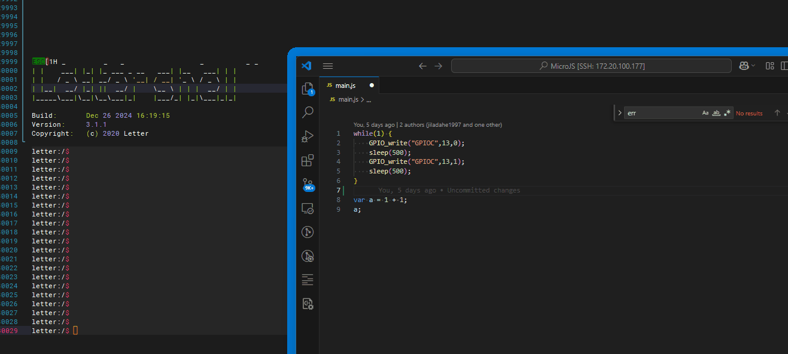
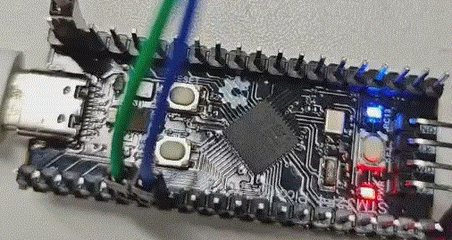

# Introduction
The main purpose of introducing this project is to demonstrate running JavaScript programs on STM32. The project is shown in the figure below:

 

## Hardware 

This project is based on: STM32F411CEU6 PICO development board, which can be purchased on taobao.com for about 30¥(5$).

Theoretically, it can also be applied to any other MCU development board, but it requires some development work.

>The author is looking for income outside of work. If you have good ideas, you can contact this email: jiladahe1997@foxmail.com

 

## Features
- The underlying system is based on FreeRTOS, which can easily expand FATFS, USB, TCP or other functions
- Support xmodem protocol to transfer files
- An interactive shell
- A highly customizable JavaScript engine, you can interact freely in C and JavaScript
- The JavaScript engine is based on jerryscript, and in theory it can be replaced with other engines

 

## Thanks
 - FreeRTOS:https://github.com/FreeRTOS/FreeRTOS-Kernel
 - letter-shell:https://github.com/NevermindZZT/letter-shell

 
 
 
 
 
 
 
 

# 简介
这个项目的主要目的是为了演示在STM32上运行JavaScript程序，其项目运行后的如下图所示:

 

## 硬件
本项目基于：STM32F411CEU6 PICO开发板，可在taobao上购买，约30¥

理论上也可以应用于任何其他的MCU开发板，但是需要一定的开发工作。

>作者正在寻找工作之外的收入，如果你有好的点子，可以联系此邮箱: jiladahe1997@foxmail.com

 

## Features
 - 底层基于FreeRTOS系统，可以方便的扩展FATFS、USB、TCP或其他功能
 - 支持xmodem协议传输文件
 - 一个可以交互的shell
 - 可高度定制的的JavaScript引擎，你可以在C和JavaScript中随意交互
 - JavaScript引擎基于jerryscript，理论上可以更换为其他引擎

 

## 感谢
 - FreeRTOS:https://github.com/FreeRTOS/FreeRTOS-Kernel
 - letter-shell:https://github.com/NevermindZZT/letter-shell